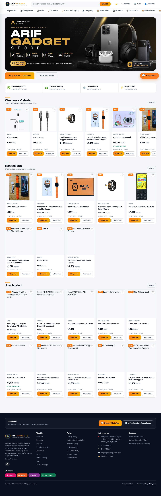

# Arif Gadget Store

Repository: [bayzed123/arifgadget.store](https://github.com/bayzed123/arifgadget.store)  
Audited commit: `f79cb604880814e5adf15230b43ec407c82d0726` on `main`

## What this project is

A wholesale gadget commerce application with a React 18/Vite/TypeScript storefront deployed as a GitHub Pages SPA and a Hono TypeScript API on Cloudflare Workers. The API uses D1/SQLite, KV, optional R2 media, and optional Workers AI.

## Live evidence

`https://arifgadget.store/` returned HTTP 200 during the audit. The page title was **Wholesale Gadgets, Factory Direct — Arif Gadgets**. A Playwright full-page screenshot is included below. This confirms the storefront homepage was reachable at capture time; it does not confirm API, checkout, admin, payment, or deployment health.



The screenshot visibly shows search, category navigation, hero promotion, product grids, discounts, cart/account links, order tracking, chat/WhatsApp contact, delivery promises, and footer policy/contact areas.

## Documented features

The source covers product catalogue, search/filter/sort, categories, product details, reviews, volume pricing, MOQ, cart, server-side stock/pricing checks, checkout, delivery/postcode lookup, order tracking, invoices, WhatsApp handoff, customer accounts, order history, wishlist, and admin modules for products, inventory, orders, reviews, staff, settings, and analytics. Optional integrations include Steadfast, Google tools, Workers AI, Groq, Resend, and Meta conversions.

## Local rebuild

```bash
npm install
printf 'JWT_SECRET=local-dev-secret\n' > worker/.dev.vars
npm run migrate:local --workspace worker
npm run dev:api
```

In another terminal:

```bash
npm run dev:web
```

The documented API address is `127.0.0.1:8787` and Vite is `127.0.0.1:5173`. For production, configure `API_DOMAIN`, `WORKERS_SUBDOMAIN`, or `API_BASE_URL` before building the Pages SPA.

## Scripts and pipeline

Use `dev:api`, `dev:web`, `build`, `typecheck`, workspace migration, `bootstrap`, `deploy:api`, `generate-sitemap`, and `cf-doctor`. CI runs Node 20, npm install, typecheck, web build, local D1 migrations, Worker startup, and API smoke test. Deployment has separate API and Pages jobs: it provisions resources, migrates D1, deploys the Worker, sets secrets, provisions the owner, builds the SPA, writes `404.html`, `.nojekyll`, `CNAME`, generates a sitemap from the live API, and publishes Pages.

## Production variables

Configure `CLOUD_FLARE_API` and `CLOUD_FLARE_ACCOUNT_ID` or the helper's accepted Cloudflare aliases, `ADMIN_USERNAME`, `ADMIN_PASSWORD`, optional `ADMIN_NAME`/`ADMIN_EMAIL`, `API_DOMAIN`/`WORKERS_SUBDOMAIN`/`API_BASE_URL`, and integration secrets such as Steadfast, Google service account, Groq, Resend, Meta, and report-trigger credentials. No environment example file was found in the audit; add and maintain one.

## Deployment checklist

Rotate any credentials ever shared in project documentation, set a strong JWT secret, close the first-run owner setup after creating an account, configure `ALLOWED_ORIGINS`, verify the API DNS record (it was unresolved during the audit), test D1 backups and restore, and confirm Pages-to-Worker API connectivity before accepting orders.

## Known limits

The storefront was reachable, but `api.arifgadget.store` did not resolve during the audit. No full install, typecheck, build, remote migration, deployment, or end-to-end test was run. API health and checkout remain unverified.
