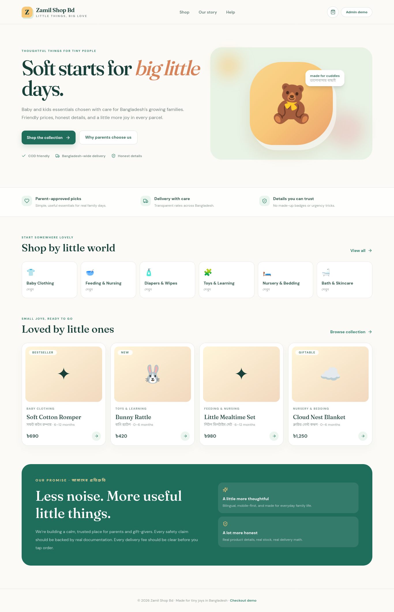
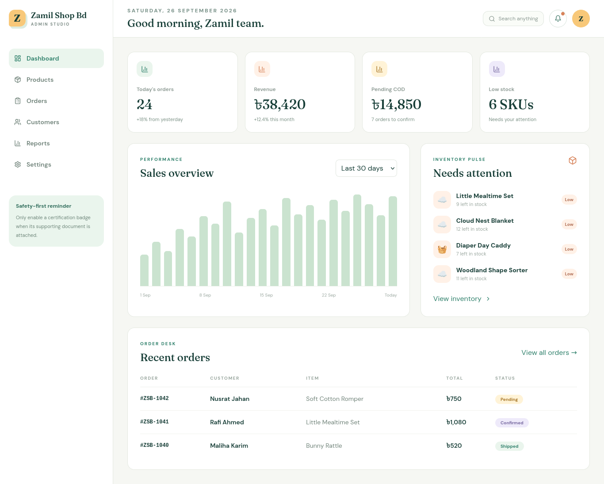

# Babyshop: Live Proof

## Evidence status

The storefront route returned **HTTP 200** during the longer Playwright verification pass. The admin route returned **HTTP 200** and rendered the page title **Zamil Shop Bd · Baby & Kids**.

> HTTP status and screenshots prove that the routes responded at capture time. They do not prove authenticated admin access, database correctness, payment success, checkout completion, backups, or security. The admin screenshots show the public entry/login surface only; no credentials were entered.

## Live links

- Storefront: [https://zamil-shop-bd-api.sayadmdbayezidhosan.workers.dev/](https://zamil-shop-bd-api.sayadmdbayezidhosan.workers.dev/)
- Admin dashboard entry: [https://zamil-shop-bd-api.sayadmdbayezidhosan.workers.dev/admin/](https://zamil-shop-bd-api.sayadmdbayezidhosan.workers.dev/admin/)
- Source repository: [https://github.com/bayzed123/babyshop](https://github.com/bayzed123/babyshop)

## Storefront screenshot

## Admin dashboard screenshot

## What to verify next

Use the project setup and deployment pages to run the authenticated acceptance pass: sign in with an authorized client account, verify products and inventory, test cart and checkout in the intended sandbox, inspect order and customer views, verify role permissions, test webhooks and notifications, and confirm backups and restore. Never place real payment credentials or customer data in this documentation.

## Cross-reference

This live Worker is the supplied deployment proof for the Babyshop repository guide. The live brand name is Zamil Shop BD, so verify the intended client/repository mapping before handoff.

- [Setup](setup.md)
- [Features](features.md)
- [Deployment](deployment.md)
- [Whitelabel Rebranding](whitelabel.md)
- [Harbal Pakriti](../harbal-pakriti/index.md)
