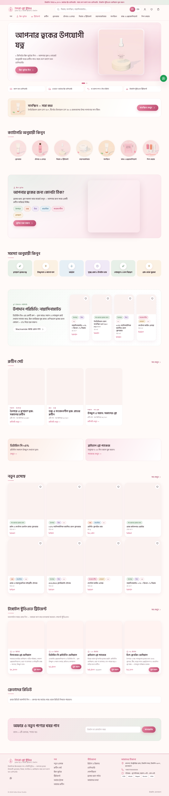
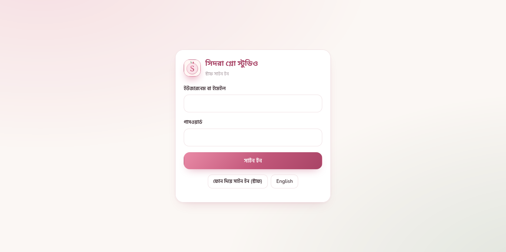

# Sidra Glow Studio: Live Proof

## Evidence status

The storefront route returned **HTTP 200** during the longer Playwright verification pass. The admin route returned **HTTP 304** and rendered the page title **স্টাফ সাইন ইন — Sidra Glow Studio**.

> HTTP status and screenshots prove that the routes responded at capture time. They do not prove authenticated admin access, database correctness, payment success, checkout completion, backups, or security. The admin screenshots show the public entry/login surface only; no credentials were entered.

## Live links

- Storefront: [https://sidra-glow-studio.sayadmdbayezidhosan.workers.dev/](https://sidra-glow-studio.sayadmdbayezidhosan.workers.dev/)
- Admin dashboard entry: [https://sidra-glow-studio.sayadmdbayezidhosan.workers.dev/admin/](https://sidra-glow-studio.sayadmdbayezidhosan.workers.dev/admin/)
- Source repository: not supplied; do not infer one from the live site

## Storefront screenshot

## Admin dashboard screenshot

## What to verify next

Use the project setup and deployment pages to run the authenticated acceptance pass: sign in with an authorized client account, verify products and inventory, test cart and checkout in the intended sandbox, inspect order and customer views, verify role permissions, test webhooks and notifications, and confirm backups and restore. Never place real payment credentials or customer data in this documentation.

## Cross-reference

No source repository was supplied for this live Worker, so this folder records live evidence only. Add the repository link and split source guide when its code repository is available.

- [Harbal Pakriti](../harbal-pakriti/index.md)
- [Jewellery and Fashion](../jewellery-and-fashion/index.md)

- [Demu Highlighted Showcase](../../showcase/index.md)
