# Demu Live Demo Showcase

## Highlighted live proof

The public [Demu client demo hub](https://demu.sayadbayezid.com/) is the related demo-admin showcase for these documentation projects. It is a client-facing collection of working storefronts and admin dashboards rather than a static portfolio image.

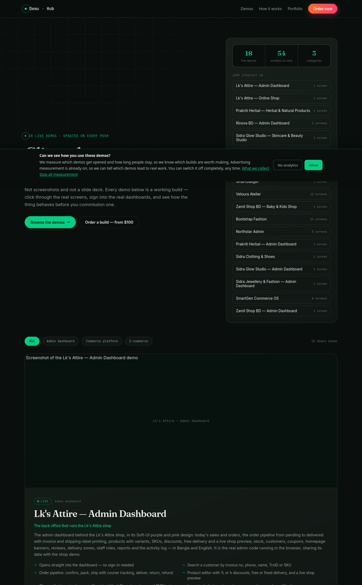

**Capture verification:** the live hub and each raw demo URL below returned **HTTP 200** during the Playwright capture pass on 2026-10-02. The screenshots show fictional demo data from the public demo site. They are not proof of production database access, real payments, authenticated production admin access, backups, or security.

## How to use the showcase

1. Open the **storefront** link to review the customer experience.
2. Open the **admin** link to review the owner workflow and dashboard.
3. Use the project documentation link to rebuild, deploy, and rebrand the corresponding client project.
4. Use only fictional details in checkout. The demos are for review; no payment or delivery is real.
5. For demo credentials, use the credentials shown on the Demu card. Never reuse demo credentials in production.

## Related project showcase

### LKS Attire

**Repository mapping:** [bayzed123/lks-attire](https://github.com/bayzed123/lks-attire)

- **Demu storefront:** [Open LKS Attire shop](https://demu.sayadbayezid.com/d/lks-attire-shop/)
- **Raw storefront:** [Open raw shop](https://demu.sayadbayezid.com/demos/lks-attire-shop/index.html)
- **Demu admin:** [Open LKS Attire admin](https://demu.sayadbayezid.com/d/lks-attire-admin/)
- **Raw admin:** [Open raw admin](https://demu.sayadbayezid.com/demos/lks-attire-admin/index.html)
- **Docs:** [LKS Attire setup guide](../projects/lks-attire/index.md)

Highlights: Bangla/English storefront, filters, product variants, cart, checkout, orders, invoices, stock, customers, coupons, homepage banners, reviews, delivery zones, staff roles, reports, and activity log.

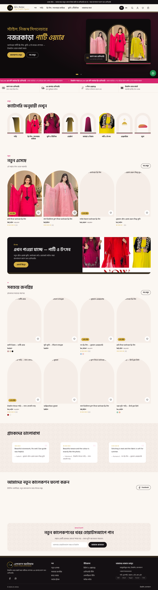

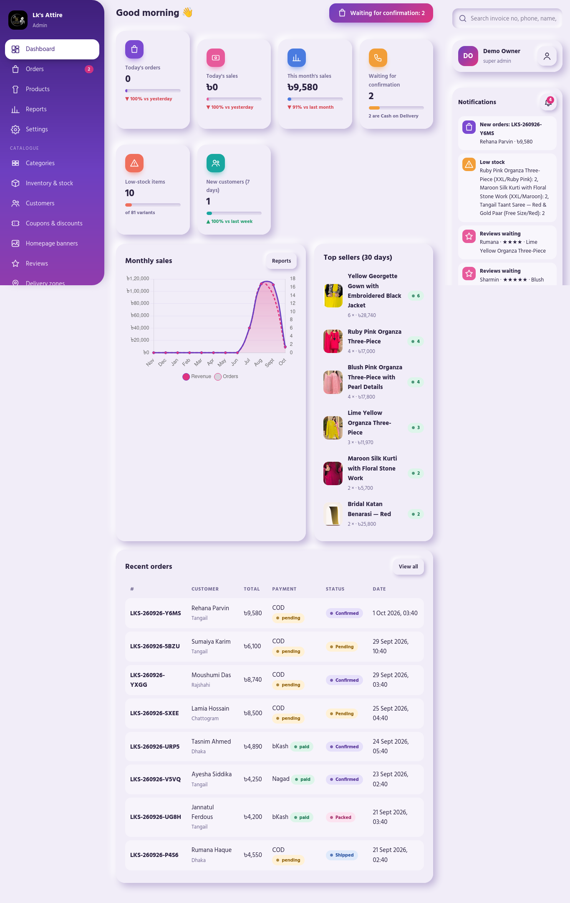

### Harbal Pakriti → Prakriti Herbal demo

**Repository mapping:** [bayzed123/harbal-pakriti](https://github.com/bayzed123/harbal-pakriti)

- **Demu storefront:** [Open Prakriti Herbal](https://demu.sayadbayezid.com/d/prakriti-herbal/)
- **Raw storefront:** [Open raw shop](https://demu.sayadbayezid.com/demos/prakriti-herbal/index.html)
- **Demu admin:** [Open Prakriti Herbal admin](https://demu.sayadbayezid.com/d/prakriti-herbal-admin/)
- **Raw admin:** [Open raw admin](https://demu.sayadbayezid.com/demos/prakriti-herbal-admin/index.html)
- **Docs:** [Harbal Pakriti setup guide](../projects/harbal-pakriti/index.md)

Highlights: wellness-needs filtering, kit builder, savings display, journal, batch and best-before dates, product disclaimers, delivery zones, SMS-code demo checkout, orders, invoices, inventory, certifications, reports, and admin activity tracking.

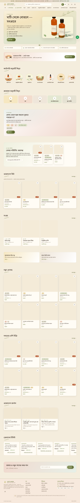

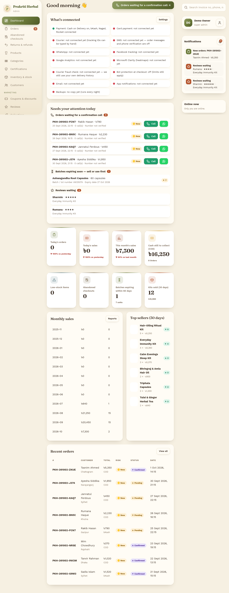

### Jewellery and Fashion → Sidra Jewellery & Fashion demo

**Repository mapping:** [bayzed123/jewellery-and-Fashion-](https://github.com/bayzed123/jewellery-and-Fashion-)

- **Demu storefront:** [Open Sidra Jewellery](https://demu.sayadbayezid.com/d/sidra-jewellery/)
- **Raw storefront:** [Open raw shop](https://demu.sayadbayezid.com/demos/sidra-jewellery/index.html)
- **Demu admin:** [Open Sidra Jewellery admin](https://demu.sayadbayezid.com/d/sidra-jewellery-admin/)
- **Raw admin:** [Open raw admin](https://demu.sayadbayezid.com/demos/sidra-jewellery-admin/index.html)
- **Docs:** [Jewellery and Fashion setup guide](../projects/jewellery-and-fashion/index.md)

Highlights: occasion-based browsing, collections and sets, ring and bangle size guides, material and plating details, gift wrap, COD checkout, bKash/Nagad/Rocket demo options, invoices, coupons, product SKUs, abandoned checkouts, staff roles, and reports.

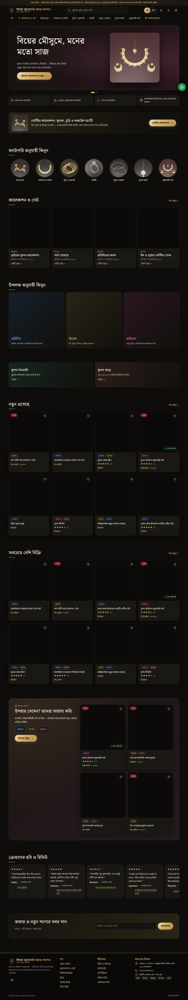

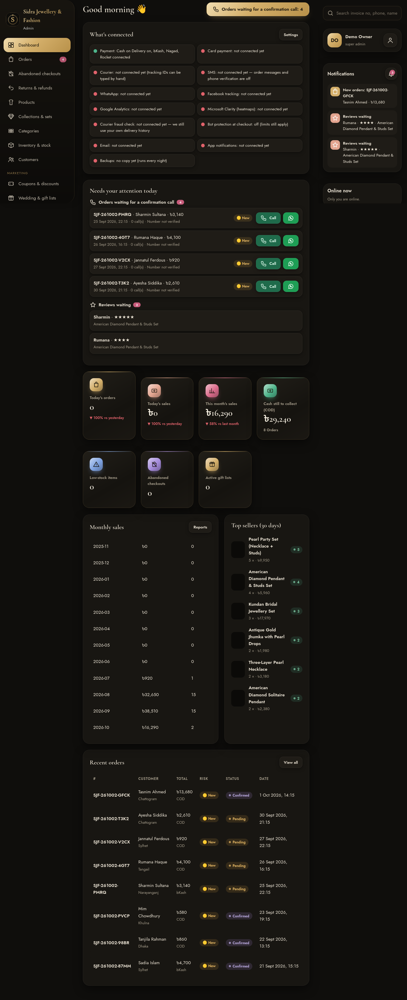

### Babyshop → Zamil Shop BD demo

**Repository mapping:** [bayzed123/babyshop](https://github.com/bayzed123/babyshop)

- **Demu storefront:** [Open Zamil Shop BD](https://demu.sayadbayezid.com/d/zamil-shop-bd/)
- **Raw storefront:** [Open raw shop](https://demu.sayadbayezid.com/demos/zamil-shop-bd/index.html)
- **Demu admin:** [Open Zamil Shop admin](https://demu.sayadbayezid.com/d/zamil-shop-bd-admin/)
- **Raw admin:** [Open raw admin](https://demu.sayadbayezid.com/demos/zamil-shop-bd-admin/index.html)
- **Docs:** [Babyshop setup guide](../projects/babyshop/index.md)

Highlights: browse by age, gift finder, gift registry, safety certificates, Bangla/English switch, COD checkout, bKash/Nagad/Rocket demo options, invoices, coupons, order pipeline, inventory, gift registries, reviews, delivery zones, staff roles, and reports.

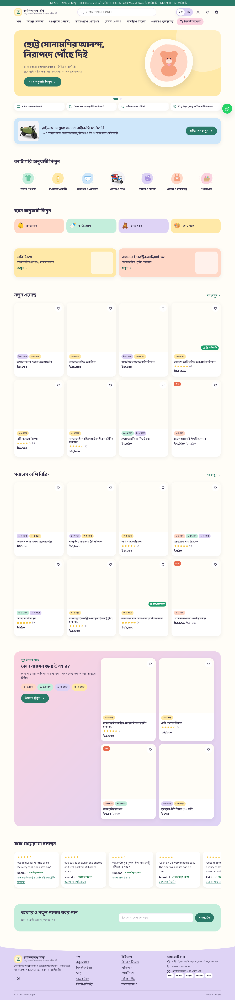

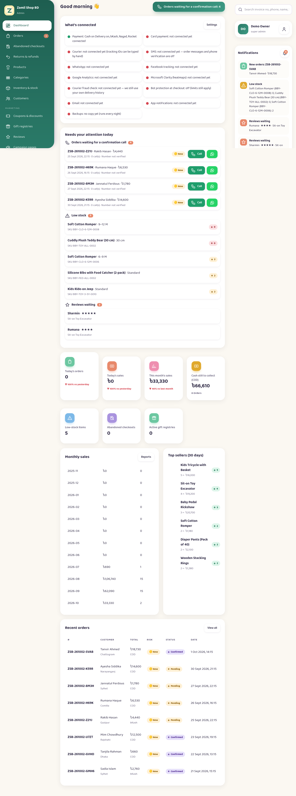

### Sidra Glow Studio — live-only related demo

No source repository was supplied for this demo, so it is documented as **live-only** rather than mapped to a source project.

- **Demu storefront:** [Open Sidra Glow Studio](https://demu.sayadbayezid.com/d/sidra-glow-studio/)
- **Raw storefront:** [Open raw shop](https://demu.sayadbayezid.com/demos/sidra-glow-studio/index.html)
- **Demu admin:** [Open Sidra Glow admin](https://demu.sayadbayezid.com/d/sidra-glow-studio-admin/)
- **Raw admin:** [Open raw admin](https://demu.sayadbayezid.com/demos/sidra-glow-studio-admin/index.html)
- **Docs:** [Sidra Glow live-proof page](../projects/sidra-glow-studio/live-proof.md)

Highlights: skincare filters, ingredient and best-before details, skin quiz, routine builder, treatment bookings, delivery zones, demo SMS verification, invoices, bookings diary, treatments, batches and expiry, staff roles, reports, and activity log.

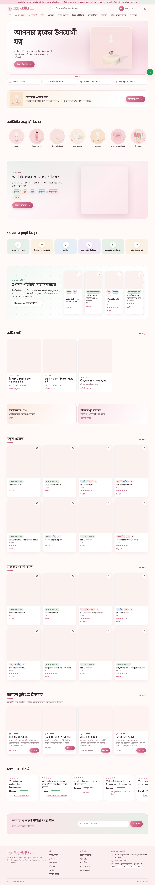

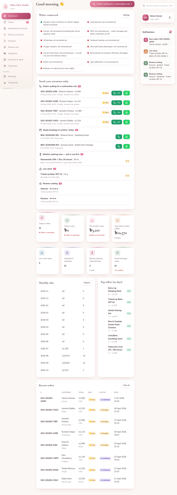

## Related source repository

The demo hub source and generation workflow are maintained in [bayzed123/websites-tamplate](https://github.com/bayzed123/websites-tamplate). Its manifest documents the demo folders, featured cards, admin routes, fictional demo credentials, and the safety boundary that keeps real backend data and production secrets out of the public showcase.

The demo repository is useful for **review and presentation**. It is not a replacement for the source repository's setup, environment, pipeline, deployment, or whitelabel instructions.

## Showcase acceptance checklist

- [x] Live demo hub opens at `https://demu.sayadbayezid.com/`.
- [x] Five related storefront/admin mappings are linked.
- [x] Ten raw demo routes returned HTTP 200 during capture.
- [x] Storefront and admin screenshots are stored in this documentation repository.
- [x] Each mapped project links back to its separate setup guide.
- [ ] Authenticate against a real production admin — not performed and not required for this fictional demo evidence.
- [ ] Test a real payment, courier booking, or customer notification — intentionally not performed.
